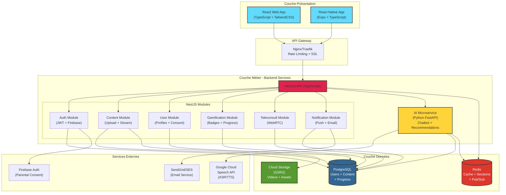
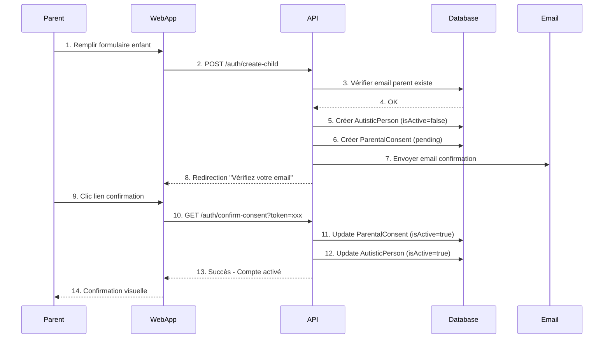
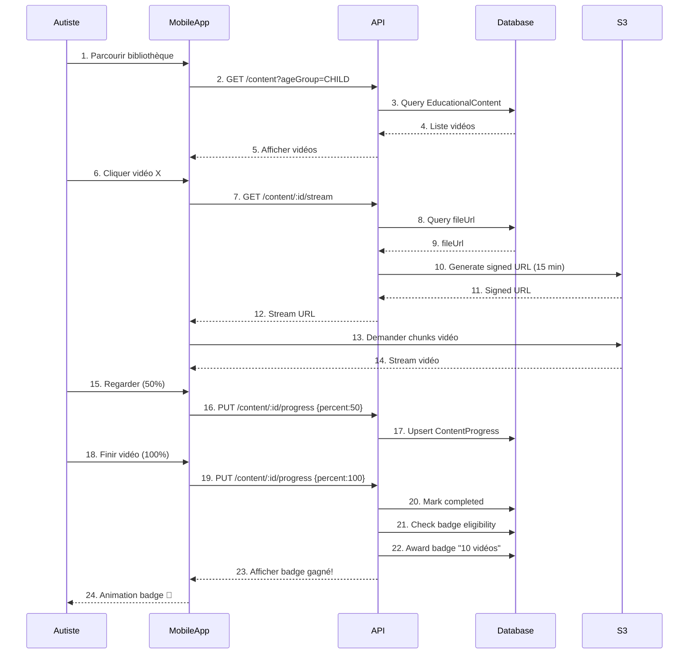
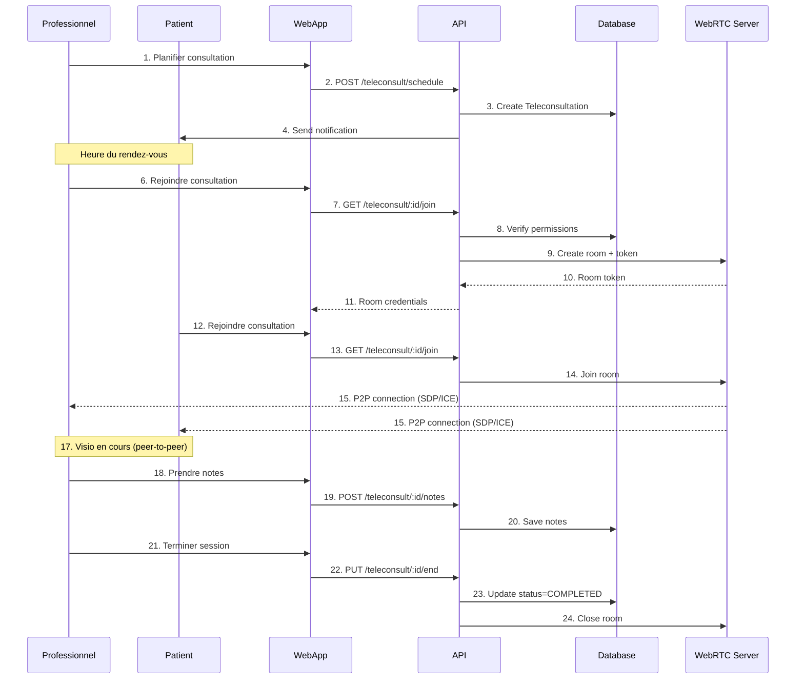
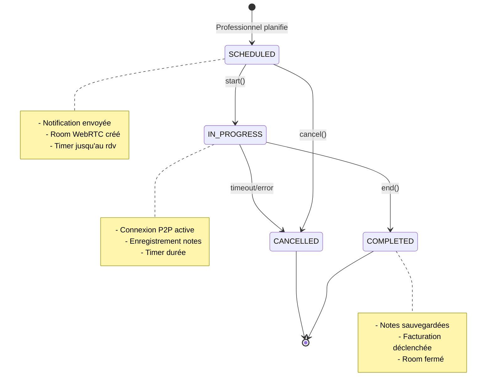
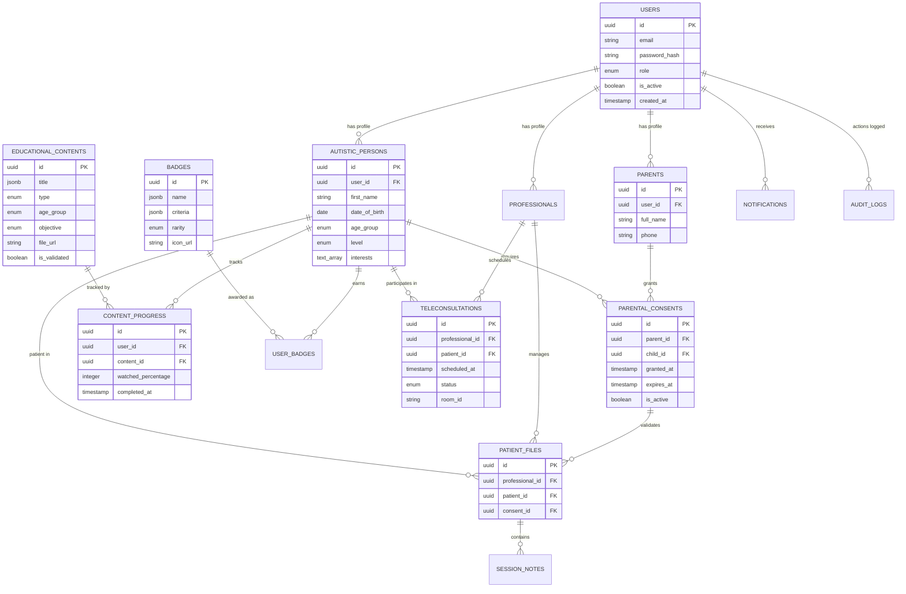
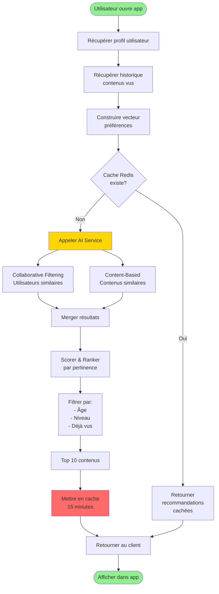
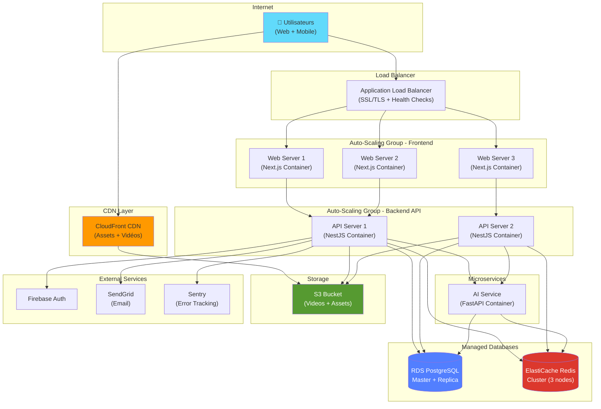

# projet-stage
# AÏDAA - Diagrammes Architecturaux

## Diagramme d'Architecture Système

## Diagramme de Classes Simplifié

```mermaid
classDiagram
    class User {
        <<abstract>>
        +UUID id
        +string email
        +string passwordHash
        +UserRole role
        +DateTime createdAt
        +boolean isActive
        +login() AuthToken
        +logout() void
        +updateProfile() void
    }
    
    class AutisticPerson {
        +UUID userId
        +string firstName
        +Date dateOfBirth
        +AgeGroup ageGroup
        +DifficultyLevel level
        +string[] interests
        +watchVideo() void
        +completeActivity() void
        +earnBadge() void
    }
    
    class Parent {
        +UUID userId
        +string fullName
        +string phone
        +AutisticPerson[] children
        +addChild() void
        +viewDashboard() Dashboard
        +getNotifications() Notification[]
    }
    
    class Professional {
        +UUID userId
        +string fullName
        +Specialty specialty
        +string licenseNumber
        +Patient[] patients
        +createPatientFile() PatientFile
        +addNote() void
        +startConsultation() Teleconsultation
    }
    
    class ParentalConsent {
        +UUID id
        +UUID parentId
        +UUID childId
        +DateTime grantedAt
        +DateTime expiresAt
        +boolean isActive
        +grant() void
        +revoke() void
        +isValid() boolean
    }
    
    class EducationalContent {
        +UUID id
        +JSON title
        +ContentType type
        +AgeGroup ageGroup
        +Objective objective
        +DifficultyLevel level
        +integer durationMinutes
        +string fileUrl
        +string[] tags
        +upload() void
        +validate() void
        +getRecommendations() Content[]
    }
    
    class ContentProgress {
        +UUID id
        +UUID userId
        +UUID contentId
        +integer watchedPercentage
        +DateTime completedAt
        +markComplete() void
        +updateProgress() void
    }
    
    class Badge {
        +UUID id
        +JSON name
        +JSON criteria
        +BadgeRarity rarity
        +string iconUrl
        +award() void
        +checkEligibility() boolean
    }
    
    class PatientFile {
        +UUID id
        +UUID professionalId
        +UUID patientId
        +ParentalConsent consent
        +SessionNote[] notes
        +addNote() void
        +shareVideo() void
        +getProgress() Progress
    }
    
    class Teleconsultation {
        +UUID id
        +UUID professionalId
        +UUID patientId
        +DateTime scheduledAt
        +TeleconsultStatus status
        +string roomId
        +schedule() void
        +start() WebRTCConnection
        +end() void
    }
    
    User <|-- AutisticPerson
    User <|-- Parent
    User <|-- Professional
    
    Parent "1" --> "*" AutisticPerson : manages
    Parent "1" --> "*" ParentalConsent : grants
    ParentalConsent "*" --> "1" AutisticPerson : for
    
    AutisticPerson "1" --> "*" ContentProgress : has
    ContentProgress "*" --> "1" EducationalContent : tracks
    
    AutisticPerson "1" --> "*" Badge : earns
    
    Professional "1" --> "*" PatientFile : manages
    PatientFile "*" --> "1" AutisticPerson : for
    PatientFile "1" --> "1" ParentalConsent : requires
    
    Professional "1" --> "*" Teleconsultation : schedules
    Teleconsultation "*" --> "1" AutisticPerson : with
```

## Séquence: Création Compte Enfant avec Consentement

## Séquence: Visualisation Vidéo avec Progression

## Séquence: Téléconsultation WebRTC

## Diagramme d'État: Cycle de vie Teleconsultation

## Diagramme ER: Relations Base de Données

## Flux de Données: Recommandation IA

## Architecture Déploiement Cloud

